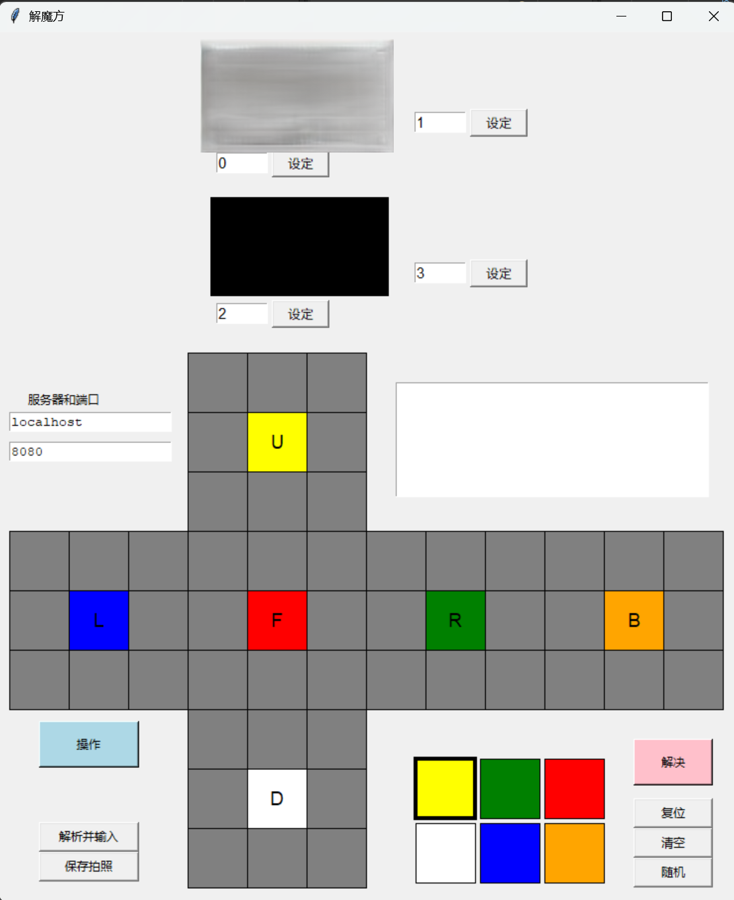

# 解魔方机器人的上位机程序
## 概述
本项目为解魔方机器人的上位机程序，从hkociemba的[RubiksCube-TwophaseSolver](https://github.com/hkociemba/RubiksCube-TwophaseSolver)程序修改而来。

本人的Python水平有限，无法保证修改后代码的完美性、稳定性和高效性。如果你的目标只是简单地解魔方并探索其模式，[Cube Explorer](http://kociemba.org/cube.htm) 可能是更好的选择。如果你希望深入理解两阶段算法的复杂性，或者你正在进行一个构建能够实现近乎完美的魔方机器人项目，那么可以尝试使用并修改本项目或者修改hkociemba的原始项目。
## 使用方法

此软件未上传到PyPI，因此无法通过 pip 直接安装。你需要从 GitHub 上下载该项目：
```bash
https://github.com/nrrx9ygq9t-creator/RubiksCube-PC-Code
```

建议使用 Python 3.7 或更高版本。你可以从 [Python 官方网站](https://www.python.org/downloads/) 下载并安装 Python。

低于 Python 3.7 的版本未测试过，可能无法正常运行。

此外，由于此程序调用了 OpenCV、NumPy和Pillow，你还需要安装这些依赖包：
```bash
py -m pip install opencv-python
```
```bash
py -m pip install numpy
```
```bash
py -m pip install pillow
```

运行start_sever.py以启动本地服务器。此时有一些表格需要创建，但仅在第一次运行时创建。这些表格大约占用 80 MB 的磁盘空间，并且根据你的硬件，生成可能需要大约半小时或更长时间。然而，“正是通过这些计算量大的表格，算法才能高效运行，通常能够找到接近最优的解。”

运行client_gui2.py以启动客户端GUI程序。你可以在GUI中手动输入魔方的各个面颜色，点击“解决”按钮，程序将返回解法并显示在GUI中。

在GUI中，你可以选择使用摄像头，程序将尝试通过摄像头识别魔方的颜色。请确保摄像头已连接，并且在GUI中选择了正确的摄像头。但是我并不建议在平时使用中使用摄像头功能，因为图像识别是用固定点RGB识别颜色的，容易受到光线、摄像头位置、摄像头型号等因素的影响，导致识别错误或失败，只有在四个摄像头都固定后，在group_(num).py中设置好摄像头详细参数后，才能保证识别的准确性。

当固定好摄像头且设置好图像处理参数后，可以按下GUI中的“操作”按钮，程序将自动完成识别魔方的颜色、输入到GUI中、上传数据到服务器求解、返回解法和将解法输出到串口的整个流程。但是串口信息和波特率需要在client_gui2.py中设置好，才能保证数据被正确传输。

本程序的魔方识别功能是使用openCV库实现的，识别的原理是通过摄像头拍摄魔方的图像，然后裁切出魔方的六个面，并对每个面进行RGB颜色识别存入vision_params.py中。随后自动输入到GUI中，最后调用twophase算法求解。

输出的解法是一个字符串，格式为用空格分隔的旋转步骤。例如，'U1 R2 U3' 表示顺时针旋转GUI中显示的U面90度、顺时针旋转GUI中显示的R面180度、顺时针旋转GUI中显示的U面270度。

对于一些具体的运算算法细节，可以访问 https://github.com/hkociemba/RubiksCube-TwophaseSolver 去了解更多。

***
